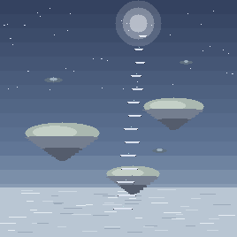

# Stairway to Heaven

A content mod for [Necesse](https://necessegame.com) (game version **1.3.2**) that completes
the game's vertical axis: after the Cave Ladder (down) and the Deep Cave Ladder (further
down), the **Stairway to Heaven** ascends **up** — through the cloud ceiling into the
**Skyreach**, a persistent sky dimension of floating islands drifting over an endless
Mistsea.

> _Deutsch? Siehe [unten](#-deutsch)._



## What is in it (v0.6.0)

Counted from the registries, not from memory: **73 objects · 46 items · 15 tiles ·
26 mobs · 7 biomes · 5 journal quests · 2 dimensions · 92 recipes**, every ID named
in English and German.

> **This section describes v0.6.0 and `master` has moved past it** — the six
> realms are now depth bands of one level rather than two dimensions, and the
> registries are larger. The counts that are kept current are in
> [`docs/OVERVIEW.md`](docs/OVERVIEW.md) (what works) and
> [`docs/AREA_OVERVIEW.md`](docs/AREA_OVERVIEW.md) (how full each realm is,
> measured by `tools/area_census.py`). Those two are the status documents;
> this one is the pitch.

### The Skyreach — four sky biomes

A real third world layer (`+1`, above `surface`/`cave`/`deepcave`): persistent,
infinite and seeded, generated region-by-region exactly like the underground
layers — not an instanced pocket level. Every world gets its own sky.

- **Driftlands** (54% of the land) — silver-green isles, Sky Reeds, Zephyr Rays
- **Stormveil** (19%) — charcoal slate, glowing Storm Crystals, Storm Wisps
- **Skyway Passages** (15%) — a *built* biome: cloudmarble causeways with
  balustrades, real fence gates where a road breaks one, Seraph statues at the
  junctions, Sky Seraphs growing wild in their frost form
- **Aurora Shoals** (13%) — cold dawn light, Aurora Blooms, rich Aetherium
- plus the **skystone barrens** cutting across all four, and the **Mistsea**,
  the swimmable cloud-ocean you bridge or swim

### The Stairway, and the Warden

Craft the Stairway to Heaven at a Tungsten Workstation (8 Tungsten Bars +
15 Quartz) and climb. It is a **portal, not a coordinate ladder**: wherever you
build it, it routes to the one canonical Old Warden Spire, a furnished 21×21 hall
with a double wall ring, eight doors and four furnished corner rooms.

The **Sky Warden** living there is hired through Necesse's own recruitment flow
and moves into your Surface settlement as a real settler. He hands over the
**Silver Bell**, which is the only key to the Veil. His quest chain sends you
after his two runaway cats, **Siggi and Peanut** — place a **Cat Basket**
anywhere, on any level, and that is where they live.

### The Veil

A second dimension below the deep caves, opened with a **Séance Circle** while
holding the Silver Bell. Gothic-comedy underworld with the **Gloomfen** and the
**Ashen Reach**, fen flora, ash bones and the Gloom Shade.

### Gear, and things to make

- **Seven weapons**, each calibrated against the vanilla weapon of the same class
  at the deep-cave tier: Tempest Edge (sword), Galehowl (bow), Skyreave (glaive),
  Thunderhead (greatbow), Prismcaller (staff), Skywatch Whistle (summon) and
  Stormdisc (returning thrown ring).
- **The Stormsteel set** — helm, cuirass, greaves — plus three real trinkets
  (Stormsteel Vambrace, Aurora Locket, Zephyr Harness), all benchmarked against
  their vanilla counterparts rather than invented.
- **Three settlement workstations** a settler runs unattended: the Windsilk Loom,
  the Aether Forge (the only source of Stormsteel) and the Stormglass Kiln.
- **Sky livestock**: Nimbus Yak, Glimmergoat and the Cloud Lamb — milked,
  sheared and bred like vanilla animals, with recipes hanging off their
  products.
- **Two building sets** — "Nightfell & Skylight" and Cloudmarble — with walls,
  doors, windows, fences, gates, floors, lighting and furniture.

### On the Surface

Three rare points of interest scattered by vanilla's own world-preset system
(an aeronaut camp, a sky-fragment crater, a skyward shrine), and the **Skyfall**
night event.

### Under the hood

- **English + German** throughout; 371 locale entries, both languages in sync.
- **Reproducible pixel-art pipeline:** every texture is generated deterministically
  by `tools/asset_generator/` in vanilla sheet formats — same input, byte-identical
  output, so art changes diff cleanly.
- **Eight verification gates**, from a headless dedicated-server integration test
  to sprite-mass, sheet-format, tile-behaviour and rotation-variety audits.

See [CHANGELOG.md](CHANGELOG.md) for the release history and
[ROADMAP.md](ROADMAP.md) for what comes next.

## Installation (players)

1. Build the jar (below) or grab a release jar.
2. Drop it into your Necesse mods folder (`%appdata%/Necesse/mods` on Windows,
   `~/.config/Necesse/mods` on Linux) — or subscribe on the Steam Workshop once
   published.
3. Start the game. Progress to Tungsten tech, craft the Stairway to Heaven, place it on
   the surface, and climb.

## Building (modders)

Requirements: a **JDK 17–25** (recommended: [Temurin 21 LTS](https://adoptium.net) —
on Windows simply `winget install EclipseAdoptium.Temurin.21.JDK`), plus a Necesse
install (client **or** dedicated server). The build emits Java 8 bytecode via
`options.release` regardless of the JDK used.

**Windows** (cmd.exe — a Steam install of Necesse is auto-detected, no env var needed):

```bat
gradlew.bat buildModJar                     &:: -> build\jar\Stairway_to_Heaven-<gv>-<mv>.jar
gradlew.bat runClient                       &:: launch the game with the mod
gradlew.bat runDevClient                    &:: same, with -dev 1
```

In PowerShell prefix with `.\` (e.g. `.\gradlew.bat buildModJar`). The plain `./gradlew`
script is the Linux/macOS wrapper and won't run in cmd.exe.

**Linux/macOS**:

```bash
# auto-detects a Steam install; otherwise point at any game/server directory:
export NECESSE_GAME_DIR=/path/to/Necesse   # contains Necesse.jar or Server.jar
./gradlew buildModJar                       # -> build/jar/Stairway_to_Heaven-<gv>-<mv>.jar
./gradlew runClient                         # launch the game with the mod (client install)
./gradlew runDevClient                      # same, with -dev 1
```

The Gradle setup was modernized to **Gradle 9.7** (runs on current JDKs, checksum-pinned
wrapper, no internal Gradle APIs) while staying compatible with the upstream template
layout (`settings.gradle` holds mod info, `gradle/main.gradle` the shared logic,
`decompileToSources` still works).

### Headless integration test

`scripts/integration_test.sh` boots the official **dedicated server** with the freshly
built jar, creates a throwaway world, drives the mod's `skyreachstatus` admin command
through the server console, and asserts that the Skyreach generates (tiles, biomes,
objects) with a clean log. This catches registry mistakes, world-gen regressions and
load-order bugs without a client:

```bash
export NECESSE_GAME_DIR=/path/to/necesse-dedicated-server
./gradlew buildModJar && scripts/integration_test.sh
```

`skyreachstatus` also works on any modded server as a diagnostics command (admin,
non-cheat): it reports generated tile/biome/object counts around the origin plus
placement diagnostics — paste its output into bug reports.

## Admin commands (testing)

All ADMIN-level, all server-side.

| command | what it does |
|---|---|
| `/swhreset` | reports this world's mod state — story stage, region keys, portal unlocks, resident claims, fog and chalk ledgers. **Changes nothing.** |
| `/swhreset world` | retrofits content into ground an older build generated — boss portals, guard packs, residents, herds. Safe to run twice. |
| `/swhreset quests confirm` | puts the whole chain back to before the first ascent, so an existing save can be played from A to Z again |
| `/swhreset all confirm` | both, plus clears the one-per-world resident claims (read the warning first) |
| `/skyreachstatus` · `/edenstatus` · `/veilstatus` · `/skysurfacestatus` | what generated, per region |
| `/veilmark [player] [1/0]` | grants or revokes the Veil Mark, so the fog gate can be tested from both sides |

**An existing save does not automatically get content added after its regions
were generated** — `onRegionGenerated` fires once per region, ever. That is what
`/swhreset world` is for. The whole picture, including which build added what,
is [`docs/SAVE_COMPAT.md`](docs/SAVE_COMPAT.md).

## Troubleshooting

**The sky (or the Veil) suddenly looks like a vanilla ocean — sharks, zombies,
fireflies — with unwalkable black patches:** that world was opened in a session
where the mod was NOT active (duplicate/old jars in the mods folder, the mod
disabled in the Mods menu, or a Necesse game update that version-locked the
mod). Without the mod, the game regenerates untouched sky regions with the
vanilla island generator and can no longer read the mod's tiles in explored
regions (they render black and block movement).

Fix, in order:
1. Ensure exactly ONE `Stairway_to_Heaven-*.jar` sits in the mods folder and
   the Mods menu shows it enabled without warnings. If the game updated past
   the jar's version, rebuild the jar against the new game version.
2. With the game CLOSED, open the world save zip — usually
   `%appdata%/Necesse/saves/<world>.zip`; some co-op/server tools keep it in a
   `worlds/<world>/` folder instead — and delete BOTH artifacts of the level:
   - the level file `levels/skyreach.dat` (and/or `levels/veil.dat`), and
   - the matching region folder `levels/regions/skyreach/`
     (and/or `levels/regions/veil/`).

   The `.dat` holds the level header, the `regions/` folder holds the explored
   terrain — leaving either behind keeps the corruption. Only the sky/Veil
   resets: it regenerates cleanly on the next ascent (same layout — the seed
   derives from the world seed); quest progress up there restarts. The rest of
   the world is untouched, no cheats involved.
3. Multiplayer: world data lives ONLY in the host's save. Only the host does
   step 2 — joining players store no world files, so there is nothing to
   delete on their side. They just need the same single, current mod jar.

**Build fails instantly with `Could not initialize class
org.codehaus.groovy...ReflectionCache` (or `InvokerHelper`):** the checkout's
Gradle wrapper is older than the installed JDK supports. Current versions of
this repo ship Gradle 9.7 (JDK 17–25); if you see this error you are building
an outdated download — re-download the development branch — or, with an even
newer JDK, install [Temurin 21 LTS](https://adoptium.net) and set `JAVA_HOME`
to it for the build.

**The build succeeds but the jar says version `1.0` and adds nothing in
game:** you built the bare upstream mod template, not this mod. When
downloading as ZIP, make sure you grab the **development branch** (Code →
Download ZIP *while the branch is selected*) and run `gradlew` in the folder
whose `settings.gradle` shows the current `modVersion` — not in a
`...-master` folder.

## Repository layout

| Path | Contents |
|---|---|
| `src/main/java/stairwaytoheaven/` | mod code: entry, registry facade, `level/`, `worldgen/`, `biomes/`, `tiles/`, `objects/`, `mobs/`, `items/`, `arsenal/`, `livestock/`, `settlement/`, `surface/`, `quest/`, `commands/` |
| `src/main/resources/` | generated textures (vanilla sheet formats), `locale/` (en, de), mod preview |
| `tools/asset_generator/` | deterministic Python/Pillow pixel-art pipeline |
| `tools/*_audit.py` | the verification gates: sprite mass, sheet format, tile behaviour, rotation variety, furniture, locale, content ledger |
| `scripts/` | `fetch_dedicated_server.sh`, the headless integration test, tile-sprite and map-render checks |
| `AGENTS.md` | entry point for anyone (human or agent) changing this repository |
| `docs/OVERVIEW.md` | what exists and works right now, read off the code |
| `docs/MOD_SUMMARY.md` | the player-facing summary (German): every NPC + shop inventory, every quest, every boss, the sprite ledger |
| `docs/AREA_OVERVIEW.md` | how full each realm is — cast, spawn density, NPCs, quests, POIs, boss; measured by `tools/area_census.py` |
| `docs/SAVE_COMPAT.md` | what an existing save is missing, and the `/swhreset` command that repairs it |
| `docs/WORLD_DESIGN.md` | the concept every other design doc answers to |
| `docs/PLAN_ONE_PLANE.md` · `docs/ARCHITECTURE.md` | the one-plane law · how the mod hooks the engine |
| `docs/PLAYER_JOURNEY.md` | the player's path A to Z, read out of the code |
| `docs/CONTENT_LEDGER.md` | every registered ID and one line on what it is |
| `docs/PLAYTEST_LOG.md` | real in-game feedback, append-only, KEEP entries are player-confirmed |
| `docs/TECHNICAL_LEARNINGS.md` | verified engine behaviour, so nobody re-derives it |
| `docs/assets-style-guide.md` · `docs/ART_DIRECTION.md` | pixel rules · what to aim for |
| `docs/research/` | knowledge base: verified engine/API notes this mod is built on |
| `ROADMAP.md`, `CHANGELOG.md`, `CONTRIBUTING.md` | project management |

## Compatibility

- Built and tested against **Necesse 1.3.2** (dedicated server, headless world-gen test).
- Purely additive: no vanilla registry entries are modified and no bytecode is patched,
  so it should coexist with most mods.
- Removing the mod leaves worlds loadable (unknown level identifiers are simply not
  entered; unknown objects/items are dropped by the game's standard handling).

## License

Like the upstream mod template, this repository is released into the public domain.

---

## 🇩🇪 Deutsch

**Stairway to Heaven** ergänzt Necesse um die dritte Vertikale: Nach Leiter (Untergrund)
und Tiefen-Leiter (Deep Caves) führt die **Himmelstreppe** nach **oben** in die
**Himmelsweite** (Skyreach) — eine persistente, unendliche Himmelsebene mit schwebenden
Inseln über einem begehbaren Nebelmeer.

Stand **v0.6.0**, aus den Registries gezählt: 73 Objekte, 46 Items, 15 Tiles,
26 Mobs, 7 Biome, 5 Quests, 2 Dimensionen, 92 Rezepte.

> **Dieser Abschnitt beschreibt v0.6.0; `master` ist weiter.** Die sechs Reiche
> sind inzwischen Tiefenbänder EINER Ebene statt zweier Dimensionen, und die
> Registries sind größer. Aktuell gehalten werden
> [`docs/OVERVIEW.md`](docs/OVERVIEW.md) (was funktioniert) und
> [`docs/AREA_OVERVIEW.md`](docs/AREA_OVERVIEW.md) (wie voll jedes Gebiet ist).

**Bestehende Spielstände.** Der Mod bricht keinen alten Spielstand — aber er
kann ihm auch nichts Neues geben: `onRegionGenerated` läuft genau einmal pro
Region. Wer eine Welt vor dem 03.09.2026 erkundet hat, hat dort **keine
Boss-Portale**, und Spielen allein erzeugt keines. Dafür gibt es
`/swhreset` (ADMIN):

- `/swhreset` — meldet nur, ändert nichts
- `/swhreset world` — trägt fehlende Inhalte in bereits erzeugtes Gelände nach
- `/swhreset quests confirm` — setzt die ganze Questkette auf Anfang zurück,
  damit eine bestehende Welt von A bis Z durchgetestet werden kann

Die vollständige Beschreibung steht in
[`docs/SAVE_COMPAT.md`](docs/SAVE_COMPAT.md).

- **Bauen:** Tungsten-Werkbank → 8 Wolframbarren + 15 Quarz → Treppe auf der Oberfläche
  platzieren und benutzen. Die Treppe ist ein **Portal**: egal wo sie steht, sie führt
  zur einen Alten Wächterspitze. Multiplayer funktioniert wie bei Vanilla-Leitern.
- **Vier Himmels-Biome:** Driftlande (54 % der Landfläche), Sturmschleier (19 %,
  Sturmkristalle und Irrlichter), **Himmelswege** (15 %, ein *gebautes* Biom aus
  Cloudmarble-Alleen mit Balustraden, Toren und Seraph-Statuen) und die Aurorabänke
  (13 %, viel Aetherium) — dazu das begehbare Nebelmeer.
- **Der Himmelswächter** wird über Necesses eigenen Anwerbe-Dialog eingestellt und
  zieht als echter Siedler in deine Siedlung. Er übergibt das **Silberglöckchen**,
  den einzigen Schlüssel zum Veil, und schickt dich nach seinen Katzen **Siggi und
  Peanut** — ein platzierter **Katzenkorb** ist ihr Zuhause, auf jeder Ebene.
- **Der Veil:** zweite Dimension unter den Tiefen Höhlen, geöffnet mit dem
  **Séance-Kreis**. Gloomfen und Aschenweite, gotische Komik.
- **Sieben Waffen** (Sturmklinge, Windheuler, Himmelsreißer, Donnerhaupt,
  Prismarufer, Skywatch-Pfeife, Sturmscheibe), das **Sturmstahl-Set** und drei
  echte Accessoires.
- **Himmels-Viehzucht** (Nimbus-Yak, Donnerkiel-Huhn, Glimmerziege, Wolkenlamm) und
  **drei Siedlungs-Werkbänke**, die ein Siedler selbstständig bedient.
- **Zwei Bausets** („Nightfell & Skylight" und Cloudmarble) mit Wänden, Türen,
  Fenstern, Zäunen, Böden, Licht und Möbeln.
- Vollständig auf Deutsch lokalisiert (371 Einträge, beide Sprachen synchron).

Bauen: Ein JDK 17–25 installieren (empfohlen: Temurin 21, z. B. per
`winget install EclipseAdoptium.Temurin.21.JDK`), neues Terminal öffnen, dann im
Repo-Ordner `gradlew.bat buildModJar` ausführen (Windows-Eingabeaufforderung; in
PowerShell `.\gradlew.bat buildModJar`) — eine Steam-Installation von Necesse wird
automatisch gefunden. Unter Linux/macOS stattdessen `./gradlew buildModJar`; Details
oben. Die Roadmap (Sturm-Events, Aetherium-Rüstung, Strukturen, Himmels-Boss) steht in
[ROADMAP.md](ROADMAP.md).
